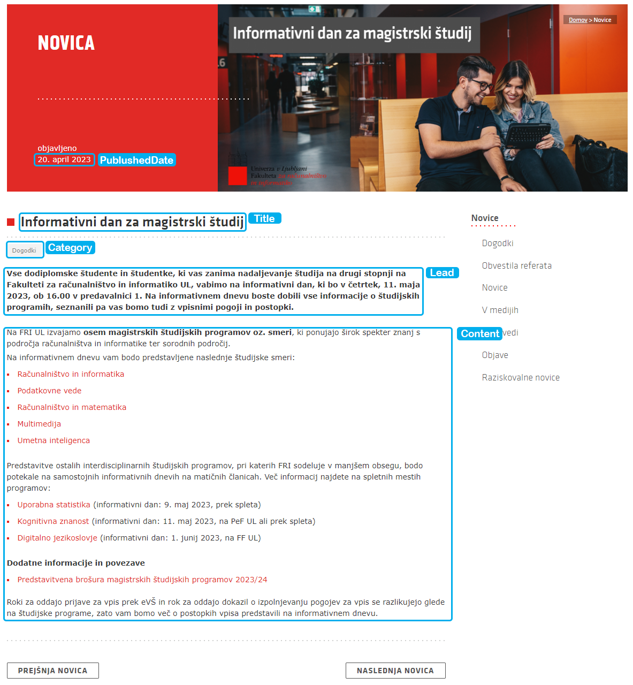

# WIER (IEPS) Programming Assignment 2
Second programming assignment for the WIER (IEPS) faculty course.

## Running the project
1. Install the required dependencies with `pip install -r requirements.txt`
2. Navigate to the `implementation-extraction` directory
3. Run the `run-extraction.py` file with `python run-extraction.py <algorithm>`

    `<algorithm>` can be one of the following arguments:
    - `A` - extract text from the web pages using regular expressions
    - `B` - extract text from the web pages using XPath
    - `C` - extract text from the web pages using a implementation of the RoadRunner algorithm

# Extracted Web Pages
The following images represent the extracted data items from the web pages:

## Overstock.com
Represents a items list page.

## Rtvslo.si
Represents a news article page.

## Fri.uni-lj.si
Represents a news article page. The original pages are available at the following links:
- [Kako izbrati študentsko delo in kje pričeti profesionalno kariero (in zakaj bi to lahko bil DevRev)?](https://fri.uni-lj.si/sl/novice/novica/kako-izbrati-studentsko-delo-kje-priceti-profesionalno-kariero-zakaj-bi-lahko-bil)
- [Informativni dan za magistrski študij](https://fri.uni-lj.si/sl/novice/novica/informativni-dan-za-magistrski-studij-2)

